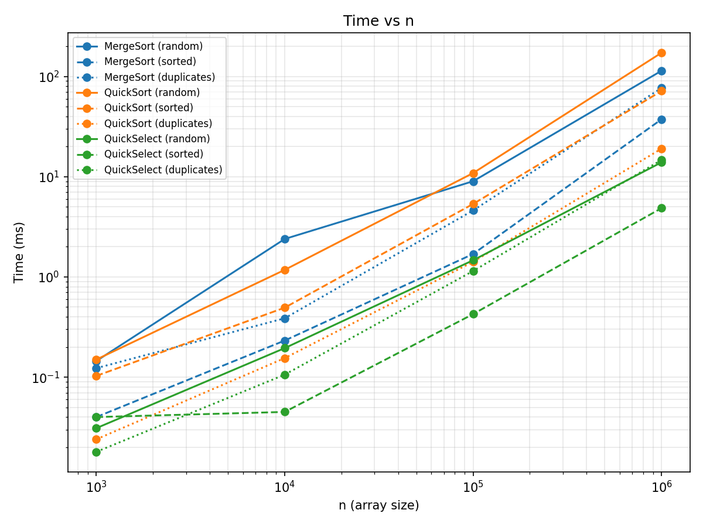
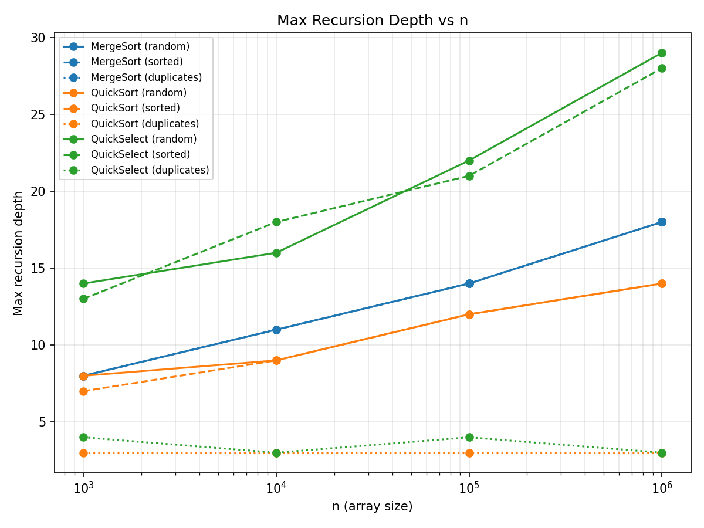
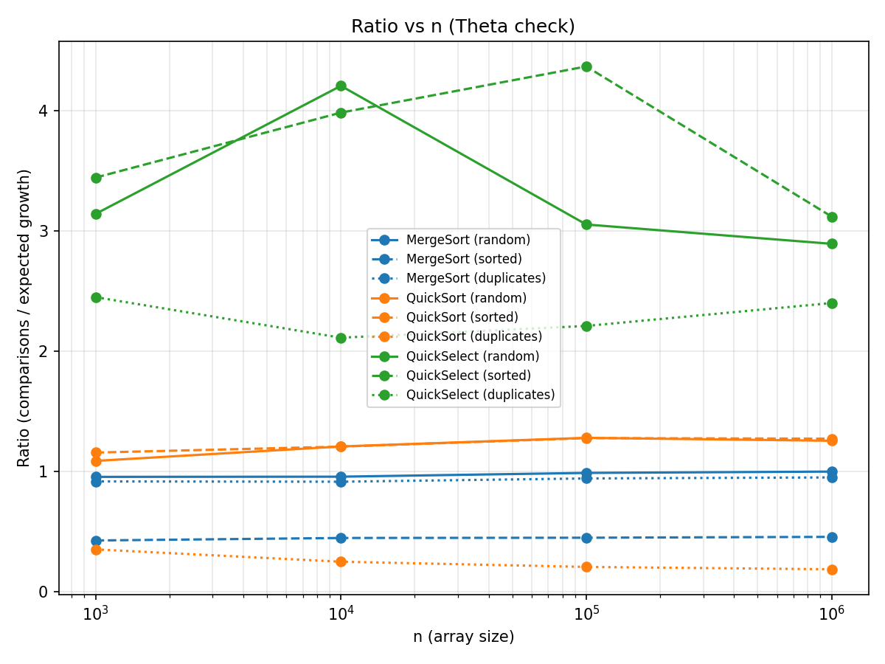

# Report — Assignment 1: Divide and Conquer & Asymptotic Notations

**Name:** Nurasyl Zhambyl
**Group:** SE-2518
**GitHub repository:** https://github.com/nurasylzhambyl06-droid/daa_assignment1

## 1. Asymptotic Bounds

| Algorithm | Best case | Average case | Worst case | Reason (worst case) |
|---|---|---|---|---|
| Insertion Sort | Θ(n) | Θ(n²) | Θ(n²) | Reverse-sorted input: every new element must shift through all previously placed elements |
| MergeSort | Θ(n log n) | Θ(n log n) | Θ(n log n) | Always splits exactly in half regardless of input — no input triggers a worse case |
| QuickSort | Θ(n log n) | Θ(n log n) | O(n²) | A pivot that is always the min/max of its subarray, causing maximally unbalanced splits (random pivot makes this astronomically unlikely in practice) |
| QuickSelect | Θ(n) | Θ(n) | O(n²) | Same adversarial pivot scenario as QuickSort's worst case — partition never reduces the problem meaningfully |

## 2. Recurrences

### MergeSort

**T(n) = 2T(n/2) + n**

- a = 2 (two recursive calls), b = 2 (each half is size n/2), f(n) = n (linear merge)
- n^(log_b a) = n^(log_2 2) = n^1 = n
- f(n) = Θ(n) matches n^(log_b a) → **Master Theorem Case 2**
- **T(n) = Θ(n log n)**

### QuickSort

Assuming a balanced split (pivot always lands near the middle):

**T(n) = 2T(n/2) + n**

- Same form as MergeSort → **Case 2** → **T(n) = Θ(n log n)**

**Why random pivot gives O(n log n) on average:** a single unlucky partition
(e.g. pivot lands near one end) does not doom the whole run — it only means
one level of the recursion tree is less balanced. Because the pivot is chosen
independently and uniformly at random on every call, the *probability* of
hitting a long run of consistently bad splits shrinks exponentially with
depth. Averaged over all possible random choices, the expected split is
"good enough" often enough that the total expected work still comes out to
Θ(n log n) — the bad cases are rare and don't dominate the average.

### QuickSelect

Assuming a balanced split:

**T(n) = T(n/2) + n**

- a = 1 (recurses into only ONE side after partitioning), b = 2, f(n) = n
- n^(log_b a) = n^(log_2 1) = n^0 = 1
- f(n) = n grows strictly faster than the constant 1 → **Master Theorem Case 3**
- **T(n) = Θ(f(n)) = Θ(n)**

**Note:** this is a different Master Theorem case than MergeSort/QuickSort
(Case 3 instead of Case 2), because QuickSelect only ever recurses into one
half of the array instead of both — so unlike a full sort, the total work
across all recursion levels forms a geometric series (n + n/2 + n/4 + ...)
that sums to O(n) rather than accumulating an extra log n factor.

## 3. Plots

- [ ] **Time vs n** — one line per algorithm, per input type (or facet by input type)
- [ ] **Max recursion depth vs n** — one line per algorithm, per input type
- [ ] **Ratio vs n**:
  - MergeSort / QuickSort: comparisons / (n * log2(n))
  - QuickSelect: comparisons / n

## 4. Θ Check

For the MergeSort on random input, the ratio comparisons / (n · log₂(n))
remains very stable across all tested values of n — from 0.95 (n = 1,000)
to 0.998 (n = 1,000,000), with no clear upward or downward trend starting from 
n = 1,000.
c₁ ≈ 0.9, c₂ ≈ 1.05, n₀ ≈ 1,000.

For the QuickSort on random input, the ratio remains within the range 
of 1.08–1.28, also stabilizing at relatively small values of n.
c₁ ≈ 1.0, c₂ ≈ 1.3, n₀ ≈ 1,000.

For the QuickSelect on random input, the ratio comparisons / n
fluctuates within the range of 2.9–4.2, without a clear stable 
trend for the tested input sizes. Larger values of n may be required
for full convergence to a constant, but the ratio remains bounded and does
not grow without limit, which is consistent with Θ(n) complexity.

## 5. Discussion
The results I obtained align well with what the theory predicts.
MergeSort and QuickSort show execution times of the same order across all input 
sizes (for example, at n = 1,000,000: 114 ms vs. 172 ms), which corresponds to 
their common asymptotic complexity of Θ(n log n).

QuickSelect was significantly faster than both algorithms for large 
n (13.9 ms vs. 114–172 ms at n = 1,000,000). This matches the Θ(n) result I derived earlier, 
since QuickSelect discards half the array 
at every step instead of processing both sides like a full sort.

One thing that stood out in my results: QuickSort's performance on sorted input didn't degrade at all.
Its execution time was of the same order as for random input 
(71.7 ms vs. 172.5 ms at n = 1,000,000, with depth = 14 in both cases). 
This directly demonstrates that a random pivot protects against the classic O(n²) 
worst case on sorted data, which would occur with a fixed pivot selection strategy.

For duplicate inputs (duplicates), all three algorithms 
showed noticeably smaller recursion depths (max_depth = 3–4 instead of 14–29) 
and fewer comparisons. This is the effect of 3-way partitioning, which immediately 
moves a large block of equal elements into the middle and does not process that block 
further.

For small n (1,000), execution time shows more noise relative to the overall trend. 
For example, QuickSort on duplicates at n = 1,000 was faster than for larger n by 
an amount that is not proportional to the input-size increase. This is a typical JVM 
warm-up effect: the JIT compiler has not yet had enough time to optimize the bytecode 
during the initial runs.

For very large n (1,000,000), the increase in execution time for MergeSort and 
QuickSort exceeds the purely theoretical n log n growth in the number of comparisons.
This is likely caused by CPU cache effects (the array no longer fits into the cache)
and Garbage Collector pauses, which are not included in the comparison count but can
still slow down actual execution.

